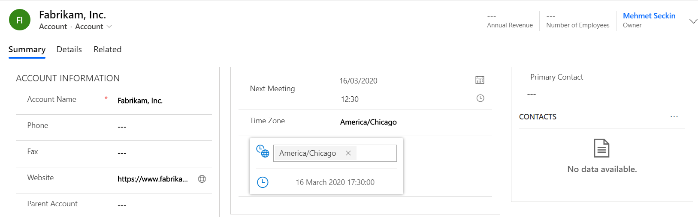
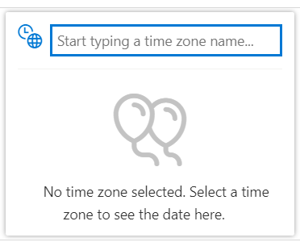
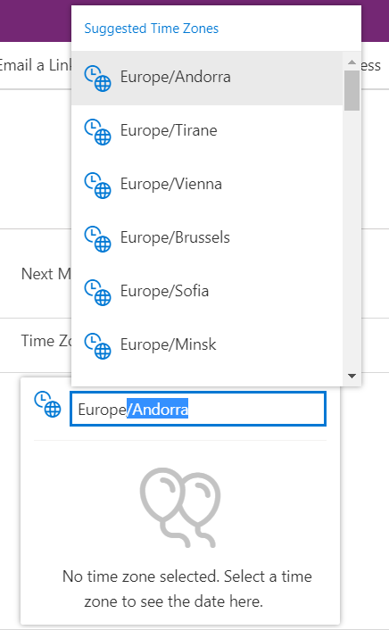
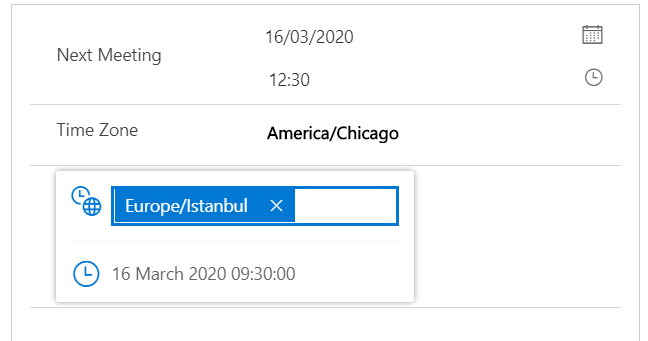

# TimeZoneDisplay

A PCF control that displays a date or date and time field in a different timezone.

## To-Do

- [x] Convert datetime to a given timezone
- [x] Provide a searchable list of timezones
- [x] Respect user personalization settings
- [x] Respect field security profiles
- [x] i18n using resource files
- [x] Set up a CI build
- [ ] Tidy-up code and add unit tests

## Contributing

Any feedback and PRs are welcome.

## Screenshots

